# E-commerce App 🛒

A modern e-commerce application built with **Flutter**, featuring a clean architecture and robust state management.

---

## ✨ Features

- User Authentication (Login/Register)
- Product Browsing & Details
- Shopping Cart
- Checkout & Payment
- Order History
- Profile Management

## 🛠️ Tech Stack

- **Flutter** - Cross-platform UI toolkit
- **Bloc & Cubit** - State management
- **GetIt** - Dependency injection
- **Clean Architecture** - Scalable structure
- **Equatable** - Value equality
- **Use Cases & Repositories** - Business logic & data handling
- **Feature-based Design** - Modular codebase

## 🎨 Screenshots

|--------------|---------------|--------------|

 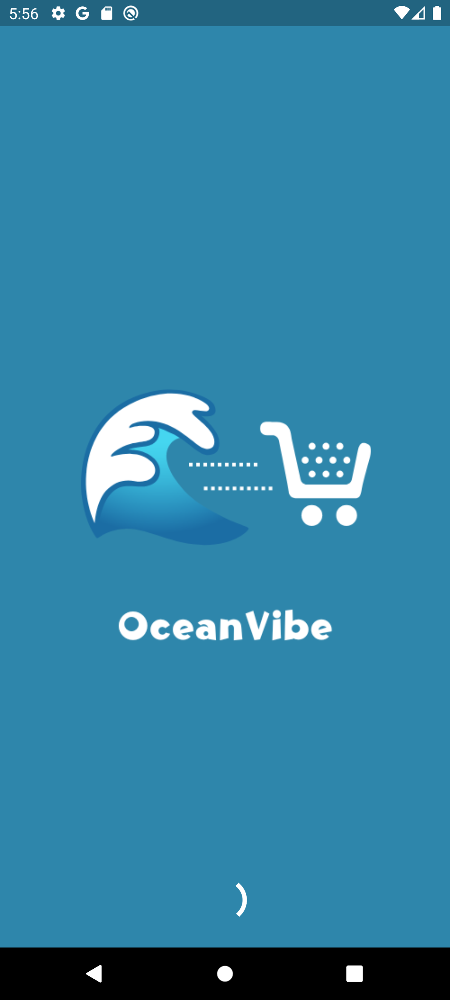  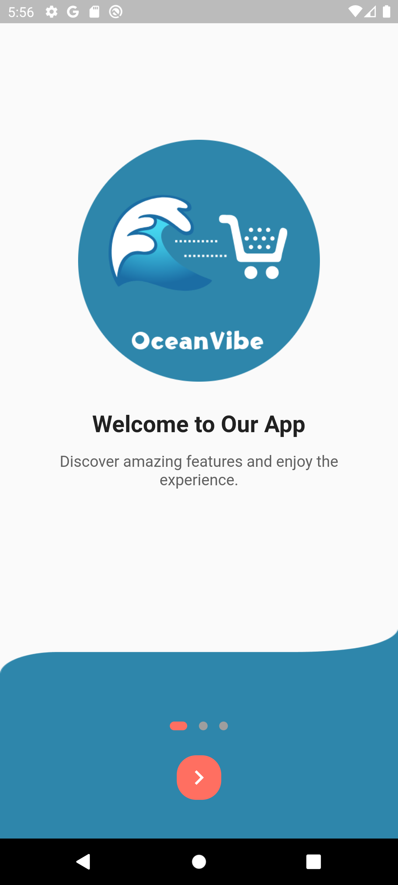  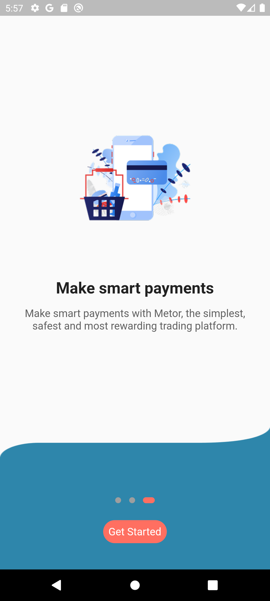  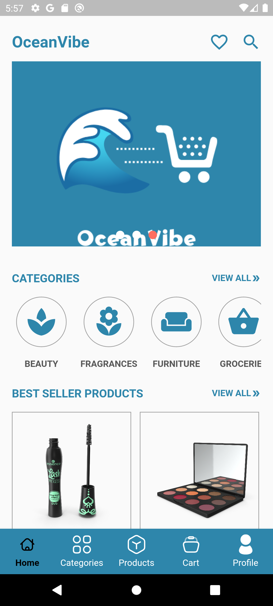 

 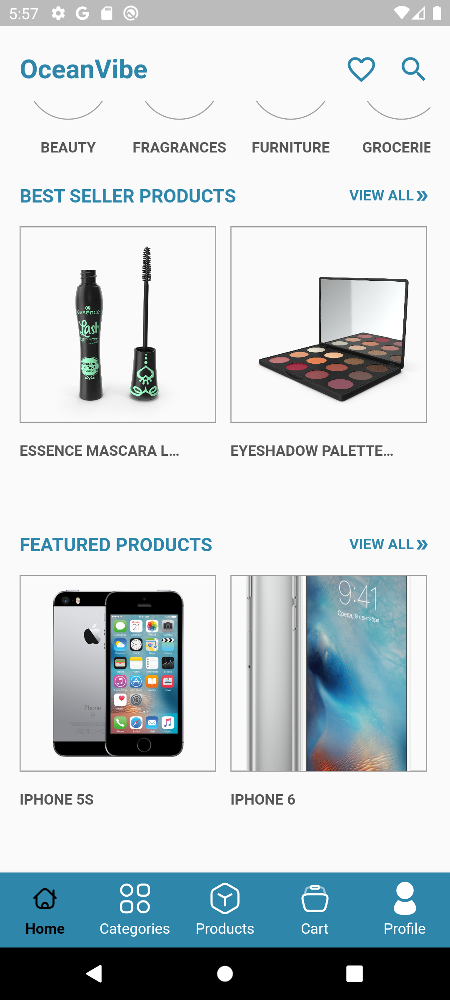  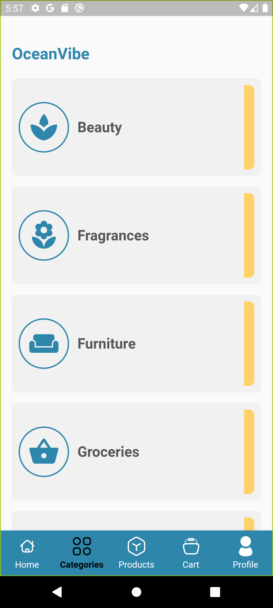  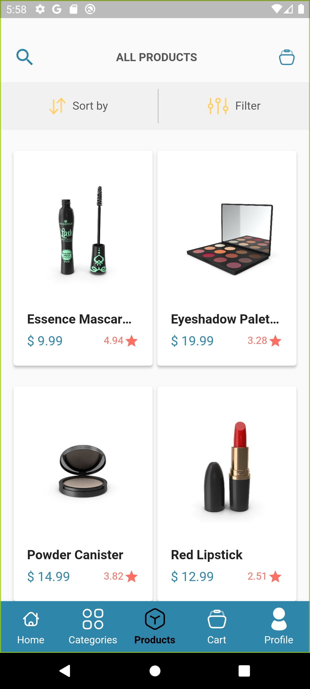  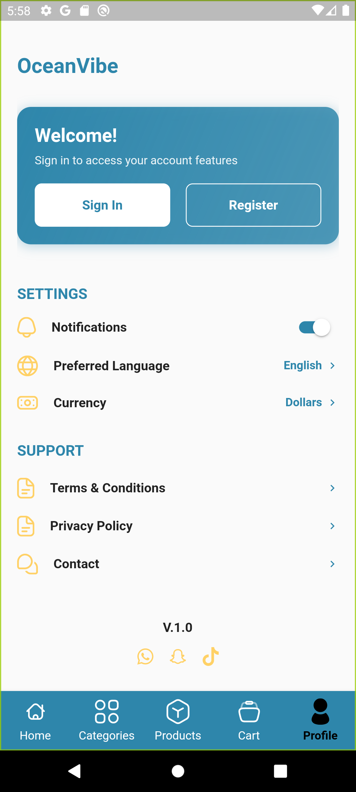

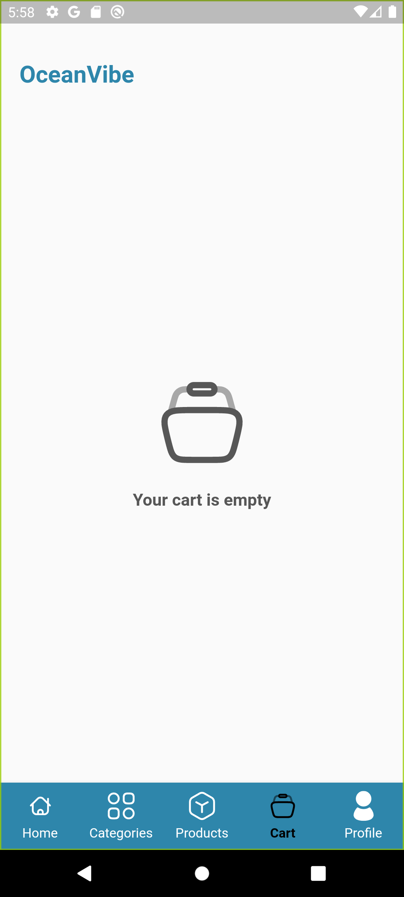    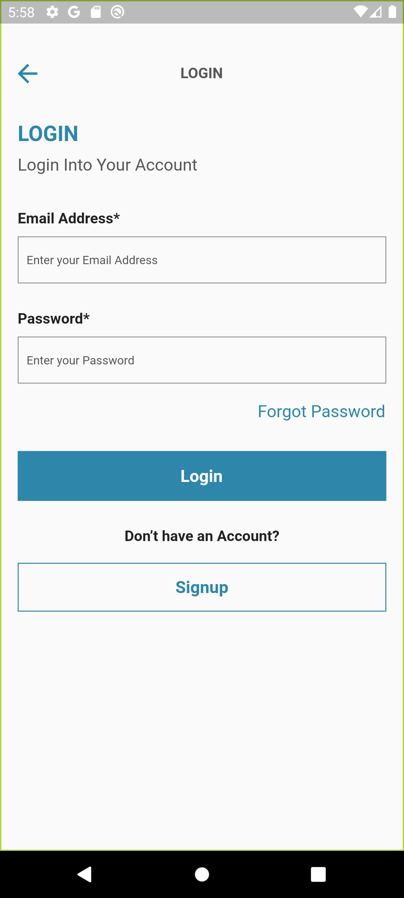  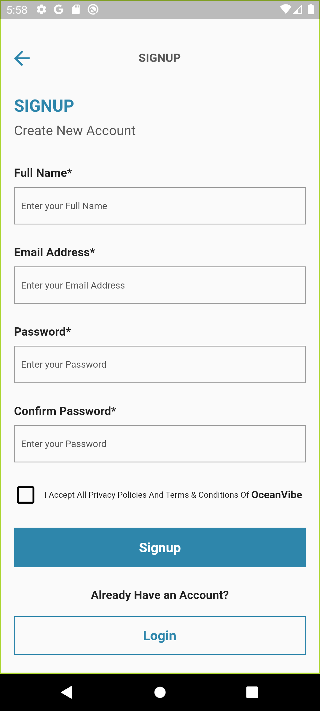 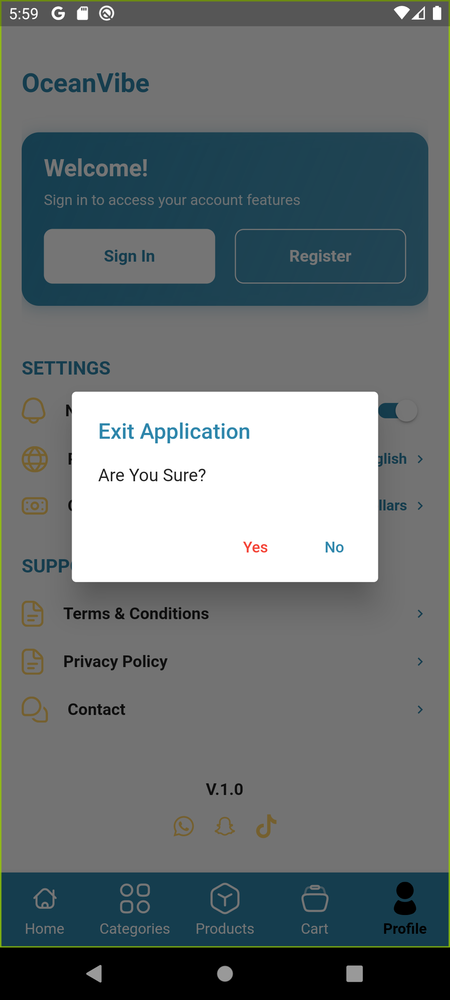

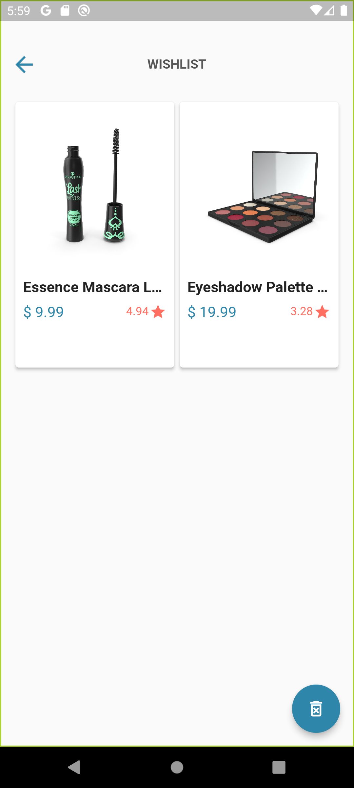  